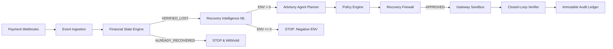

# RecoverAI

> **"Prove the money. Prioritize the chase. Recover it."**

---

> [!WARNING]
> ### ⚠️ SIMULATION / SANDBOX ONLY
> **No real payments or financial transactions are executed.**  
> All gateway dispatches run in isolated simulation harnesses to prove deterministic financial safety rails.

---

## 1. Problem Statement

In online payment ecosystems (UPI, IMPS, Cards, Netbanking):
- **15–20% of `payment.failed` webhooks are temporary false alarms** where money is authorized seconds later (*Late Authorization Flip-Flops*).
- **Blind automated retries double-charge customers**, causing chargeback disputes and destroying customer trust.
- **Retrying hard declines** (`CARD_BLOCKED`, `STOLEN_CARD`, `INVALID_ACCOUNT`) causes network penalty fines and gateway throttling.
- **Low-value, zero-intent recovery attempts** cost more in payment links and SMS fees than the expected recovery value.

---

## 2. The Solution: RecoverAI

RecoverAI is a bounded agentic payment recovery platform that separates **probabilistic AI reasoning** from **deterministic financial truth**:

$$\text{OBSERVED} \longrightarrow \text{PROVEN} \longrightarrow \text{EXPLAINED} \longrightarrow \text{GUARDED} \longrightarrow \text{EXECUTED} \longrightarrow \text{VERIFIED} \longrightarrow \text{AUDITED}$$

### Core Safety Invariant
> **"RecoverAI is not an LLM that controls payments. It is a bounded financial agent operating inside deterministic financial safety rails."**

- **The LLM is strictly advisory:** It recommends *how* to recover a payment, but has **zero** authority over ledger state, economics, firewall rules, or execution.
- **The Financial State Engine is authoritative:** Independent ledger verification confirms every outcome.

---

## 3. System Architecture



---

## 4. Key Innovations

1. **Deterministic Financial State Engine:** Proves whether money is genuinely lost (`VERIFIED_LOST`, `ALREADY_RECOVERED`, `UNCERTAIN`, `EXCEPTION`) before any action is considered.
2. **Unit-Economic Prioritization:** Calculates Expected Net Value:
   $$\text{ENV} = \left( P(\text{recovery}) \times \text{Amount} \times (1 - \text{MDR}) \right) - \text{Costs}$$
3. **Deterministic Recovery Firewall:** Enforces non-bypassable safety gates:
   - `FIREWALL-002`: Negative ENV $\to$ `STOP`
   - `FIREWALL-004`: Hard Decline $\to$ `STOP`
   - `FIREWALL-005`: Max 3 Retries $\to$ `STOP`
   - `FIREWALL-006`: Already Recovered $\to$ `STOP`
   - `FIREWALL-007`: Uncertain State $\to$ `WAIT`
   - `FIREWALL-008`: Exception State $\to$ `ESCALATE`
   - `FIREWALL-009`: Duplicate Action $\to$ `STOP`
4. **Closed-Loop Independent Verification:** Queries the ledger post-action to eliminate optimistic AI false recovery claims.
5. **Verifiable Accounting Balance:**
   $$\text{processed\_amount} = \text{amount\_recovered} + \text{amount\_withheld} + \text{amount\_pending} + \text{amount\_escalated}$$

---

## 5. Live Demonstrations & Validation

### 1. 60-Second Emergency Demo
Demonstrates `FAILED ≠ LOST` and ledger truth isolation:
```bash
python demo_60_seconds.py
```

### 2. 5-Minute Timed Judge Presentation
Complete presentation with exact speaker cues:
```bash
python demo_5_minute.py
```

### 3. Master Full System Demo
Runs the complete 7-stage closed-loop recovery with accounting balance verification:
```bash
python demo_full_system.py
```

### 4. Controlled Failure Injection & Chaos Suite
Tests gateway timeouts, duplicate webhooks, planner outages, and verification mismatches:
```bash
python validate_failure_injection.py
```

---

## 6. Automated Testing (142 / 142 Tests Passing — 100%)

Run the complete test suite:
```bash
pytest tests/ -v
```

---

## 7. Technology Stack

- **Backend:** Python 3.10+, FastAPI, Pydantic v2, XGBoost, Scikit-Learn, Pandas
- **Frontend:** React 18, TypeScript, Tailwind CSS, Lucide React, Framer Motion, Vite
- **Integrations:** Razorpay Adapter (Sandbox), Google Gemini / OpenRouter (Advisory LLM)
- **Storage:** Append-only immutable JSONL audit ledger

---

## 8. Repository Structure

```
recovaryagent/
├── src/
│   ├── state_engine/     # Deterministic Financial State Engine
│   ├── recovery/         # Recovery Intelligence ML & Economics
│   ├── agent/            # Bounded Agent Planner, Policy & Firewall
│   ├── gateway/          # Gateway Adapter & Sandbox Interface
│   ├── ingestion/        # Idempotent Webhook Ingestion Engine
│   ├── execution/        # Action Executor & Closed-Loop Verifier
│   ├── audit/            # Structured Audit Events & Accounting Metrics
│   └── api/              # FastAPI REST Endpoints & Health/Ready APIs
├── frontend/             # Command Center React Dashboard
├── tests/                # 142 Automated Pytest Tests (inc. Adversarial)
├── docs/                 # Architecture, Judge FAQ, Validation Reports
├── demo_60_seconds.py    # 60-second emergency demo script
├── demo_5_minute.py      # 5-minute timed demo script
└── demo_full_system.py   # Master closed-loop demo script
```

---

## 9. Running the Command Center Locally

### Start Backend:
```bash
python -m uvicorn src.api.server:app --host 0.0.0.0 --port 8000 --reload
```

### Start Frontend:
```bash
cd frontend
npm install
npm run dev
```
Navigate to `http://localhost:5173`.
