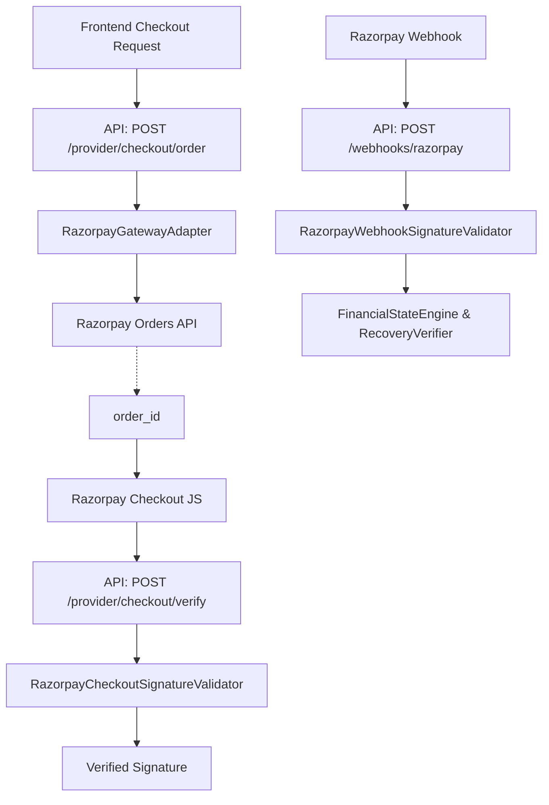

# STEP 14: Razorpay Webhook & Standard Web Checkout Integration

## Overview
Integrates Razorpay Standard Web Checkout and webhook ingestion directly into the existing RecoverAI deterministic architecture.

RecoverAI handles live money safely by:
1. Hard-blocking live transactions via `RECOVERAI_LIVE_TRANSACTIONS=false`.
2. Emitting `order_id` strictly via backend endpoints.
3. Performing signature verification via HMAC-SHA256 (`RAZORPAY_KEY_SECRET`).
4. Using strict idempotency based on `x-razorpay-event-id`.
5. Maintaining the integrity of the Decision Replay and Evidence Graph.

## Environment Variables
- `RECOVERAI_PROVIDER_MODE`: Must be `razorpay_test`
- `RAZORPAY_KEY_ID`: Your test key ID (`rzp_test_...`)
- `RAZORPAY_KEY_SECRET`: Your test key secret
- `RAZORPAY_WEBHOOK_SECRET`: Webhook signing secret
- `RECOVERAI_LIVE_TRANSACTIONS`: Must be `false`

## Architecture Flow

## Security
- `RAZORPAY_KEY_SECRET` is never exposed to the frontend.
- `RAZORPAY_WEBHOOK_SECRET` is never logged.
- Signatures are verified using constant-time comparison (`hmac.compare_digest`).
- Provider metadata is considered untrusted and cannot override deterministic policies.
- Live mode requires `RECOVERAI_LIVE_TRANSACTIONS=true`, which is intentionally blocked in current deployment.

## Evidence Nodes Added
- `RAZORPAY_WEBHOOK`
- `RAZORPAY_API_RESPONSE`
- `PROVIDER_SIGNATURE_VERIFICATION`
- `RAZORPAY_EXECUTION`
- `RAZORPAY_VERIFICATION`
